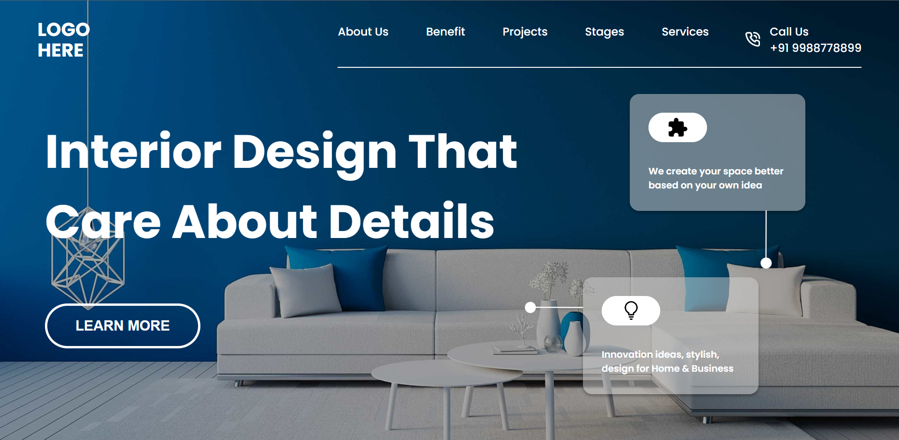

# Project 10 - HTML and CSS

## Murtuza Rangwala

## What I learned from this Project?

- I learned about positioning elements in the HTML and CSS.

- I also learned about image properties.

- I also learned how to design Buttons and Navbar.

- I also learned flex properties.

- I also Learn Transform property of CSS.

- This project took around 6 hours to complete.

## Live Link of the Project:

[Live Project Link](https://mk-interior-design.netlify.app/)

## Output:

